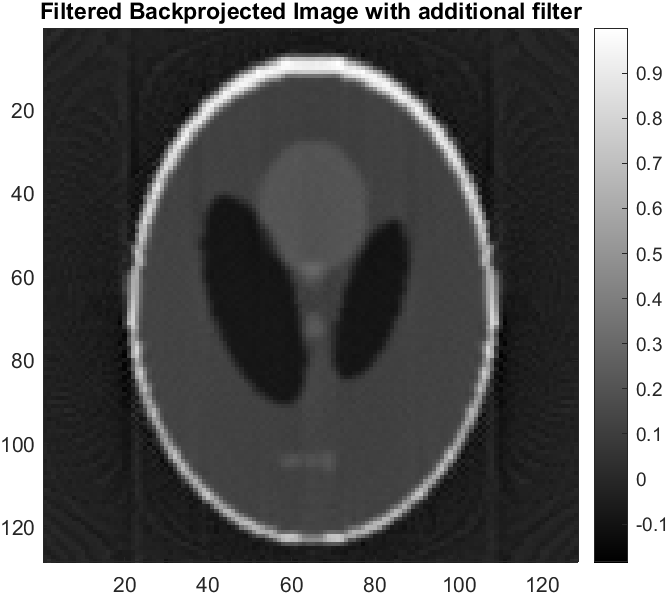

# CT_BackProjection
This repository contains MATLAB code for three stages of back projections used in image reconstruction: 
1. **Simple Back Projection**
2. **Filtered Back Projection**
3. **Hamming Filtered Back Projection**

## Table of Contents

- [Installation](#installation)
- [Usage](#usage)
- [Back Projection](#back-projection)
- [Filtered Back Projection](#filtered-back-projection)
- [Hamming Filtered Back Projection](#hamming-filtered-back-projection)
- [License](#license)
- [Acknowledgements](#acknowledgements)

## Installation

1. Clone this repository to your local machine using:
    ```
    git clone https://github.com/your-username/back-projection-techniques.git
    ```
2. Open MATLAB and navigate to the cloned repository directory.

## Usage

Each MATLAB script can be run independently to perform the respective back projection technique. Below are the descriptions of each script and their usage. In this Example we've taken a phantom


### Back Projection

The `BackProjection.m` script performs a Simple Back Projection.

Back projection is a simple image reconstruction technique used in computed tomography (CT). It involves summing up all the projections along each possible line of sight through the object and distributing the sum back into the image space. While conceptually straightforward, it often produces images with artifacts due to incomplete data and inaccuracies.


### Filtered Back Projection

The `FilteredBackProjection.m` script performs a Filtered Back Projection.

Filtered back projection improves upon the basic back projection method by incorporating a filtering step. Before back projecting, the projections are first filtered in the frequency domain, with a ramp filter, to remove low-frequency components and suppress artifacts. This helps to enhance image quality by reducing blurring and noise.


### Hamming Filtered Back Projection

The `HammingFilteredBackProjection.m` script performs a Filtered Back Projection using a Hamming filter.

Hamming filtered back projection is a variation of filtered back projection that utilizes a Hamming window in the frequency domain as the filtering function. The Hamming window is designed to balance between the mainlobe width and sidelobe levels, offering better resolution and artifact suppression compared to simple filtering techniques.



## Acknowledgements

This implementation is part of the course work for EE5613: Medical Imaging: Unveiling CT Imaging from Physics to AI Advancements
